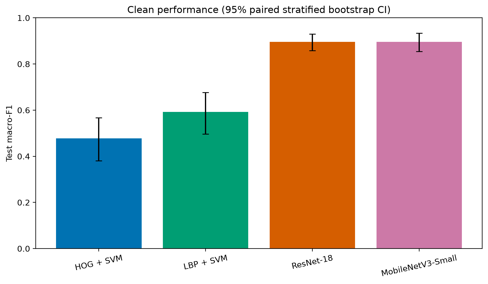
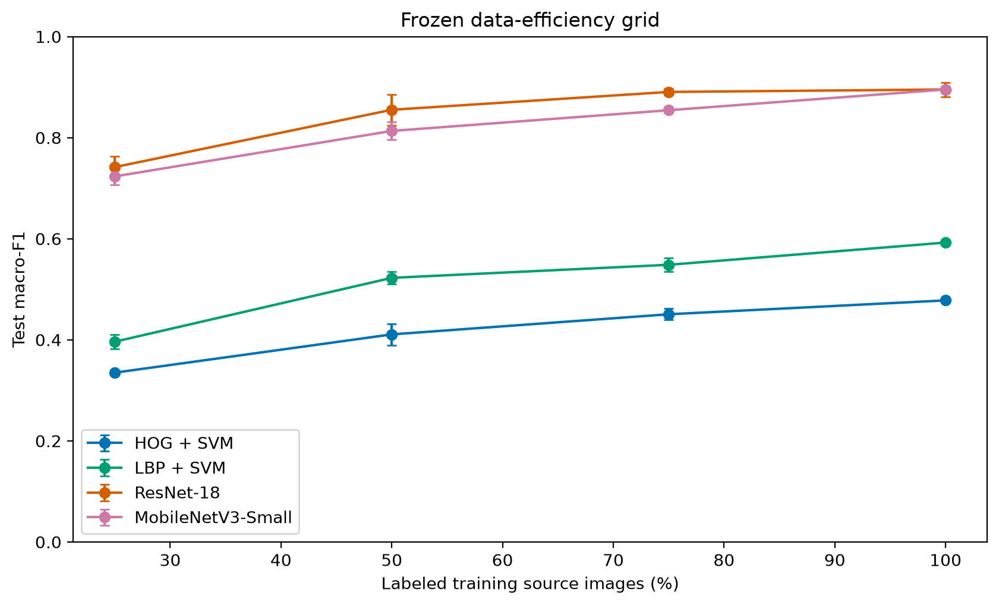
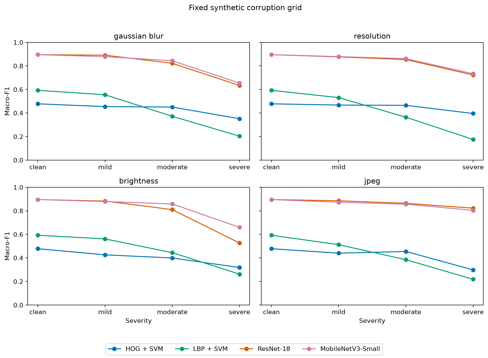

# BladeScope

### Robust Wind Turbine Blade Defect Recognition Under Limited Data and Image Degradation

BladeScope is a reproducible computer-vision research project studying six-category wind-turbine blade defect recognition under limited training data and controlled image degradation. It combines classical and convolutional classification baselines with data-efficiency and robustness experiments, Grad-CAM and blinded human review, statistical synthesis, experimental defect localization, and a Streamlit demonstration application.

**[Live Demo](https://bladescope.streamlit.app/) · [Application](#run-the-bladescope-application) · [Portfolio summary](docs/portfolio_summary.md) · [Final report](docs/phase10_final_synthesis.md) · [Results](#key-results) · [Reproducibility](#reproducibility-and-project-record) · [Limitations](#limitations)**



*Frozen clean-test comparison. CNN values aggregate the three declared seeds; interval definitions and the deterministic-baseline treatment are documented in the [final synthesis](docs/phase10_final_synthesis.md).*

## Highlights

- **720 retained full images** and **1,065 annotated defect instances/crops** across **six defect classes**.
- Classical HOG/LBP + SVM baselines and CNN baselines using ResNet-18 and MobileNetV3-Small.
- Data-efficiency experiments at four declared training-data budgets and robustness evaluation across 12 controlled synthetic degradation conditions.
- Grad-CAM analysis, a blinded two-pass human-review workflow, and a frozen statistical synthesis with paired stratified bootstrap intervals.
- A three-seed YOLO11n class-agnostic localization study and a human-reviewed automatic-region proposal workflow in the Streamlit app.
- The highest observed clean CNN means were approximately `0.895` macro-F1. Their difference was negligible, but the paired interval does **not** justify a claim of superiority or equivalence.

## Research Question

How reliably can classical and convolutional models recognize six wind-turbine blade defect categories when labeled data are limited? The project also asks how performance changes under controlled image degradation, and how errors, model activations, and localization behavior can be examined without extending the evidence to operational safety or deployment claims.

## Key Results

| Method | Clean macro-F1 | Notes |
|---|---:|---|
| HOG + SVM | `0.477988` | Deterministic handcrafted baseline; seed SD is not applicable. |
| LBP + SVM | `0.592401` | Deterministic handcrafted baseline; seed SD is not applicable. |
| ResNet-18 | `0.895314 ± 0.014118` | Mean ± sample SD across seeds 17, 29, and 43. |
| MobileNetV3-Small | `0.895321 ± 0.005977` | Mean ± sample SD across seeds 17, 29, and 43. |

On the frozen clean test set, both CNN means were substantially higher than the traditional baselines. MobileNetV3-Small had the highest observed mean performance and retention across the declared synthetic degradation grid, while ResNet-18 had the highest normalized data-efficiency area. No composite winner is defined. The paired MobileNet-minus-ResNet macro-F1 interval was `[-0.036869, 0.035522]`; it supports neither a superiority claim nor an equivalence claim.

## Visual Evidence

| Data efficiency | Controlled degradation robustness |
|---|---|
|  |  |

The left figure compares four predeclared training-data budgets. The right figure shows the four fixed degradation families at clean, mild, moderate, and severe settings. Both are descriptive summaries of the frozen experiment grid, not claims about arbitrary field conditions.

<!-- Portfolio TODO: add a real Streamlit application screenshot here after one is captured from the deployed or locally validated app; do not use a mock-up. -->

## What I Built

`Dataset audit and curation` → `source-isolated crop generation` → `HOG/LBP baselines` → `ResNet-18 and MobileNetV3-Small baselines` → `data-efficiency study` → `robustness study` → `error analysis and Grad-CAM` → `blinded human review` → `statistical synthesis` → `YOLO11n localization study` → `Streamlit demonstration app`

Each stage has a frozen configuration, machine-readable outputs, validation gates, and explicit provenance. Scientific stages remain separate from the application productization layer.

## Tech Stack

Python 3.11 · PyTorch and torchvision · scikit-learn · NumPy · scikit-image · Pillow · matplotlib · Ultralytics YOLO · Streamlit · pytest · uv

## Limitations

- The dataset is limited in size and contains defect-positive images without healthy/background-only controls; healthy-blade false-positive behavior is not measured.
- Classification covers six dataset categories, and localized crops do not cover hidden or internal damage.
- The 12 synthetic degradation conditions do not fully represent field cameras, drone flights, sites, weather, lighting, or compound degradation.
- Grad-CAM and the single-reviewer judgments are descriptive; they are not proof of causal model reasoning.
- The YOLO11n detector is an experimental, human-reviewed proposal aid, not validated automatic inspection.
- BladeScope does not assess safety, severity, progression, remaining life, or production readiness.
- Detector checkpoint, threshold, and NMS selection were frozen before held-out evaluation; no post-test tuning is permitted.

## Reproducibility and Project Record

The scientific contract is frozen in [`docs/phase0_research_contract.md`](docs/phase0_research_contract.md). The sections below preserve the detailed installation, acquisition, execution, validation, result-path, and phase-boundary record. Phases 0–10 are complete, validated, and frozen; the Phase 11A audit and Phase 11B detector study are also complete and frozen. Application v3 integrates one exact frozen detector checkpoint as an experimental, human-reviewed region-proposal aid. It is locally validated, and a public Streamlit demonstration is available at [https://bladescope.streamlit.app/](https://bladescope.streamlit.app/). Public availability does not establish production, safety, or external-domain readiness.

## Reference environment and installation

The reference interpreter is Python 3.11. With [`uv`](https://docs.astral.sh/uv/) already installed, create the environment and install the minimal development dependencies:

```bash
uv sync --extra dev
```

Runtime dependencies include PyYAML, NumPy, Pillow, matplotlib, scikit-image, scikit-learn, joblib, PyTorch, and torchvision; pytest is the development/test dependency.

## Run the BladeScope application

The repository also contains a non-scientific Streamlit application using the frozen Phase 6 MobileNetV3-Small classifier and the frozen Phase 11B proposal detector. Install its separately pinned CPU dependencies and launch it locally:

```bash
uv pip install -r requirements-app.txt
uv run streamlit run app/app.py
```

Application v3 presents **Auto detection** as its primary workflow while retaining its scientific status as an experimental, human-reviewed proposal aid. Proposals are numbered, detector confidence is shown separately, and a user must review and select boxes before the frozen six-category crop classifier runs. The dataset contains no healthy/background-only images, so this does not establish a healthy blade or assess safety, severity, progression, remaining life, or production readiness. Both exact checkpoints are included for clean-clone startup; no training, tuning, calibration, or test-set evaluation occurs. See [`docs/app.md`](docs/app.md) for the exact identities, controls, scope, and validation record.

The public Streamlit Community Cloud demonstration is available at [https://bladescope.streamlit.app/](https://bladescope.streamlit.app/). It deploys branch `main` with entrypoint `app/app.py` on Python 3.11. The app-local dependency manifest and exact frozen inference checkpoint are tracked, and no secrets are required. See [`docs/deployment.md`](docs/deployment.md) for the deployment details and validator. This public research demonstration is not a production or safety-ready inspection system.
